# [Ciallo～(∠・ω< )⌒☆](https://ciallo.cc/)
###### Preference：[简体中文](https://www.gov.cn/)｜[繁體中文](http://big5.www.gov.cn/gate/big5/www.gov.cn/)｜[日本語](https://www.kunaicho.go.jp/)｜[English](https://www.gov.uk/)
☛<a href="https://shameimaru-ayaya.github.io/">More Info</a>

   

###### 【付属資料】カラーコードまとめ
| V | HEX | Λ |
|:---:|:---:|:---:|
| 初音ミク | \#39C5BB |  |
| 重音テト | \#E25577 |  |
| 鏡音リン | \#FFA500 |  |
| 鏡音レン | \#FFE211 |  |
| 巡音ルカ | \#FFC0CB |  |
| 桃音モモ | \#FFC7C8 |  |
| 唄音ウタ | \#CB85FF |  |
| KAITO | \#0000FF |  |
| MEIKO | \#D80000 |  |
